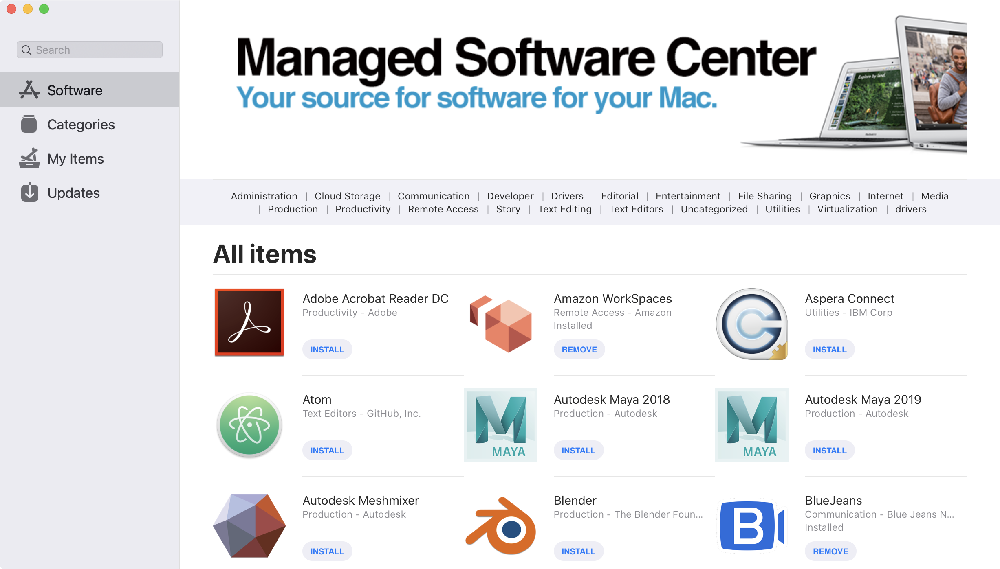
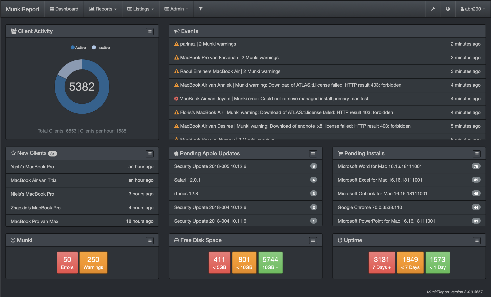
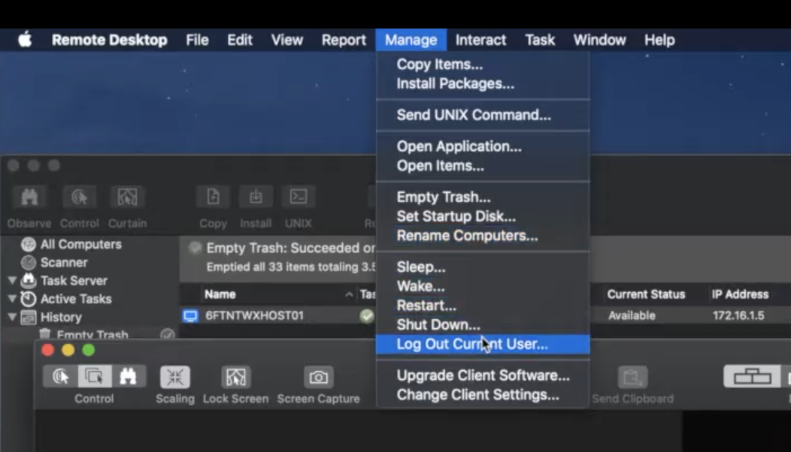

# Mac Administration
### OngoingMedia GmbH - ©Tobias Wessels - 03/2021

---
## Aufsetzen neuer Macs
 - Ansible Playbook (Ist-Zustand)
 - Images [kommen nicht in Frage](http://isimagingdead.com)
 - [Mac Deploy Stick](https://twocanoes.com/products/mac/mac-deploy-stick/)
 - [andere?](https://www.reddit.com/r/macsysadmin/comments/lkyanm/best_way_to_install_new_macbooks/) (dazu später..)

--
### Ansible Playbook
 - macOS Support ist bescheiden
  - unarchive module benötigt `gnu-tar` nicht `bsd-tar` 🤦
  - user module kann keine Benutzer unter macOS anlegen 🤨
- mac-spezifische Module fehlen oft
- Systemeinstellungen ändern ist ein Graus: Handoff, FileVault,.. 😒

--
### Mac Deploy Stick
 - Erstellt ein Installations-Medium (großer USB-Stick oder externe SSD) für macOS
 - Löscht und überschreibt Recovery- und System-Parition
 - Ergebnis: Vorinstalliertes/- und konfiguriertes System
 - Installationszeit: ~20min 🏃‍♂️

---
## Provisionierung
 - Munki
 - Jamf
 - Apple Remote Desktop
 - Ansible

--
### Munki
 <!-- .element height="20%" width="20%" -->
 - Von [Walt Disney Animation Studios](https://www.disneyanimation.com/open-source/) entwickelt 🐇
 - Bringt Software auf das installierte System
 - Jetzt ein [Open-Source Projekt auf Github](https://github.com/munki/munki)
 - Es wird lediglich ein WebServer von der Stange benötigt (Nginx, Apache, IIS) 
 - Unterstützt Configuration Profiles ...[seit Big Sur aber nur eingeschränkt](https://www.alansiu.net/2021/01/06/semi-automating-profile-installation-in-big-sur/) 😑

--
### Munki Client

--
- **Managed Installs**
  - Installiert Programme automatisch (im Hintergrund)
- **Managed Uninstalls**
  - Löscht automatisch angegebene Programme
- **Managed Updates**
  - Benutzer kann selbst Programm nachinstallieren, Munki gibt aber Version vor
- **Optional Installs** 👀
  - Der Benutzer entscheidet, was installiert wird. Nur diesen Software-Typ erscheint überhaupt im MSC
--
### Munki Ecosystem
- [Munki-Admin](https://github.com/hjuutilainen/munkiadmin) verwaltet das Repository
  - nutzt [munkitools](https://github.com/munki/munki/) im Hintergrund
- [autopkg](https://github.com/autopkg/autopkg) installiert Packete über Rezepte auf Github
- [munkireport](https://github.com/munkireport/munkireport-php) ist ein Reporting Client für Munki

--
### Munki Report 
<!-- .element height="100%" width="100%" -->
--
### Jamf
 - Eine verbreite [MDM](https://en.wikipedia.org/wiki/Mobile_device_management) Lösung, welche Funktionen des [Apple Business Managers](https://business.apple.com) integriert
 - Jamf kann Munki auf den Geräten installieren
 - Unterstützt Config Profiles
 - Benutzt [Apples Push Notification Service](https://en.wikipedia.org/wiki/Apple_Push_Notification_service)

<!-- .element height="20%" width="20%" -->

--
### Ansible
 - __Im Push-Modus__: SSH-Verbindung zum Gerät wird benötigt
  	- Port 22 im Home-Office nicht erreichbar
  	- soll auch auf keinen Fall geöffnet werden
 - __Im Pull-Modus__: Client fragt Git-Repository ab und führt Änderungen selbst aus
 	- Ergebnisse lassen sich an MS-Teams übertragen

--
### Ansible-Pull
```bash
$ % crontab -l                        
*/10 * * * * /usr/local/bin/ansible-pull -o -U \ 
https://git.ongoingmedia.de/mac-playbooks.git new-changes.yml
```
--
### Ansible-pull Monitoring
- Ergebnisse können über [callback plugin](https://docs.ansible.com/ansible/latest/collections/community/general/#callback-plugins) zurückgesendet werden
- In Teams über [Adaptive Cards](https://adaptivecards.io/designer/) aufhübschbar

```yaml
- hosts: localhost
  connection: local
  vars:
    webhook_url: "https://ongoingmedia.webhook.office.com/webhookb2/fb8afaab-896f-42b8-a7e3-53d8582a795e@9ad7b94a-e769-4cbc-b48b-66fbd732a580/IncomingWebhook/e2b1d6175bd94313b2bc654c838745dd/1e7b8b7f-6e70-437b-a054-25f3ee975ef8"
  tasks:
    - name: Microsoft Teams Webhook
      office_365_connector_card:
        webhook: "{{ webhook_url }}"
        text: "{{inventory_hostname}}: test123"
```

--
### Apple Remote Desktop
  - Desktop Sharing Tool von Apple
  - Installation von Pkg-Dateien
  - Ausführung von Shell-Befehlen
  - Multi-Monitor Support
--
### ARD Manage Optionen
<!-- .element height="100%" width="100%" -->
--
### Apple Remote Desktop 
  - Ports 5900 und 3982 müssen im VPN weitergeleitet werden
  - "Das wird nicht geroutet" laut Frank
  - siehe [mein Reddit-Eintrag](https://www.reddit.com/r/macsysadmin/comments/lunibh/apple_remote_desktop_for_provisioning_remote_users/)
 > Jamf is the answer already. ARD is for when you are all on the same LAN and don’t really need to worry about restrictions


---
## Vorschlag
 - Mac Deploy Stick erstellen
  - XCode vorinstallieren (12GB Trümmer! 🗿)
  - localhero Konto erstellen lassen
  - Automatische Updates deaktivieren 🙅🏽
  - Munki vorinstallieren
--
 - [Combo Updates](https://support.apple.com/kb/DL2052?locale=de_DE) über Munki freigeben
 	- Enthalten häufig [Fehlerbehebungen der Einzelupdates](https://discussions.apple.com/thread/251605735)
 	- Zuverlässiger
 - [Update Mechanismen in Big Sur](https://apple.stackexchange.com/a/80660) wurden leider geändert. Eventuell doch Einzelupdates benutzen

--
 - Programme über Munki aktuell halten (Managed Updates)
 	- Web-Browser
 	- Java
 	- Tunnelblick
 	- Docker
 	- Antivir

--
 - Brew Casks komplett ablösen
 - Jamf Now nutzen zur
   - Installation von Config Profiles
   - Abfrage von Systeminformationen
   - Munki ggf. nachinstallieren

---
## Wie findet Ihr das? 💁‍♂️